# Windows server 2022

## Liens utiles : 

- https://www.youtube.com/watch?v=CJgxCXj1G7Q
- https://www.microsoft.com/fr-fr/evalcenter/evaluate-windows-server-2022


## Pré-requis
- 1 machine virtuelle (DC2022)
- OS : Windows Server 2022
- 120 go répartis ainsi :
    - 62 go
    - 59 go (disque w)
    - 100 mo

La partition de restauration du système s'appelle Recovery
- Domaine : epreuve.lan
- Roles & Fonctionnalités : 
    - AD-DS
    - DNS
    - DHCP
    - WDS
- Réseau 172.16.10.0/24
- Masque de sous-réseau : 255.255.255.0
- Gateway (Passerelle/routeur) : 172.16.10.2/2
- Adresse IP en statique : 172.16.10.250/24
- DNS 1 : 172.16.10.250/24
- DNS 2 : 
    -   8.8.8.8 (adresse ip princiale de Google)
    -   8.8.4.4 (adresse ip secondaire de Google)
    -   1.1.1.1 (résolveur DNS)

L'installation de l'AD-DS depuis la version de Windows serveur 2012 induit l'installation du DNS


## Installation

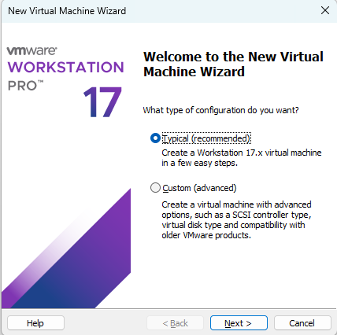
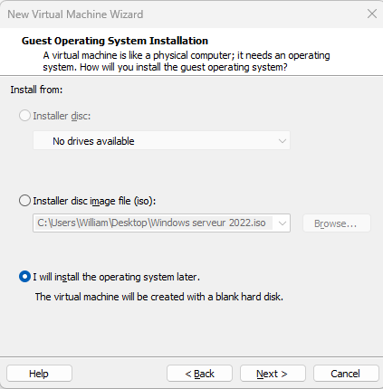
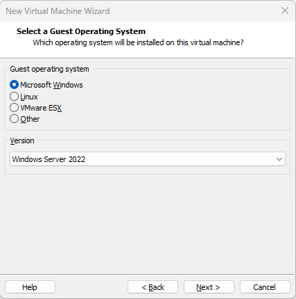
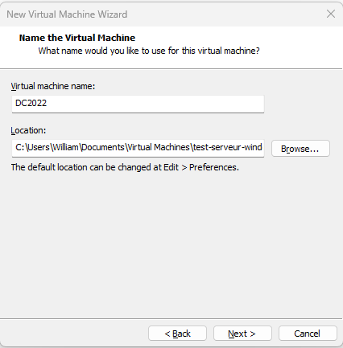
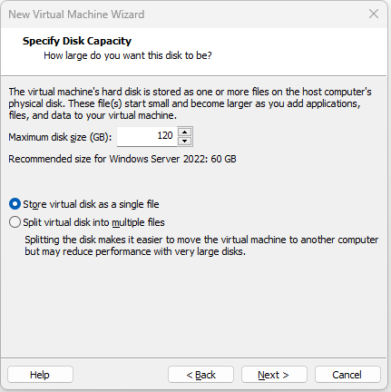
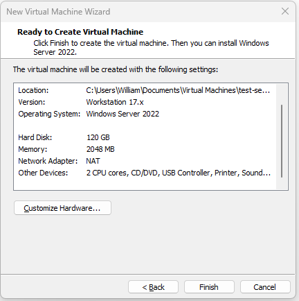
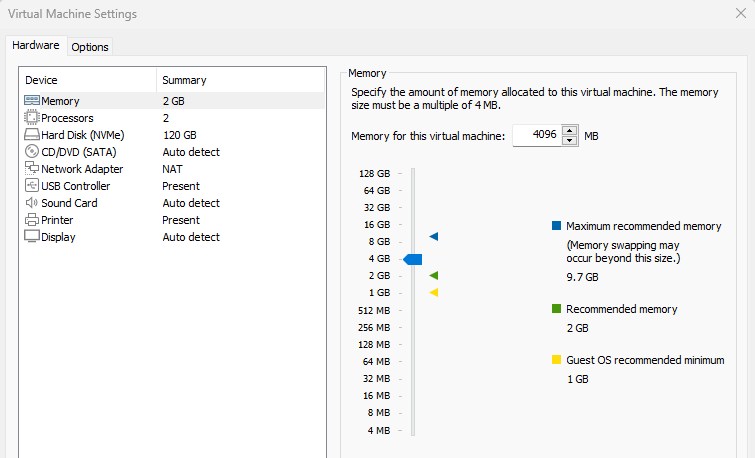
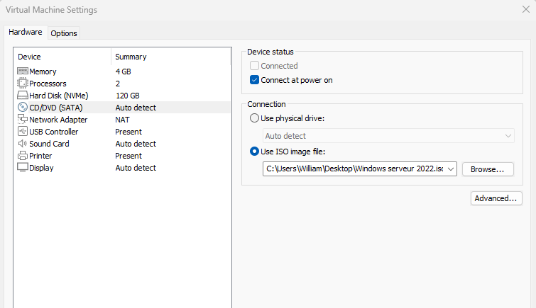
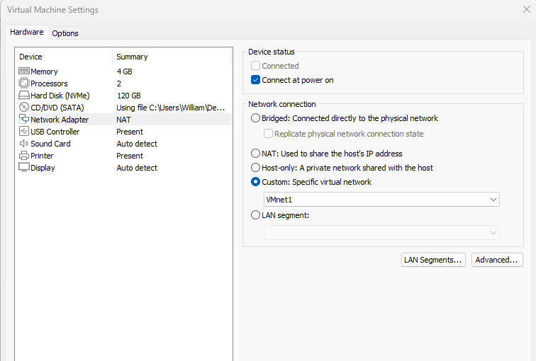
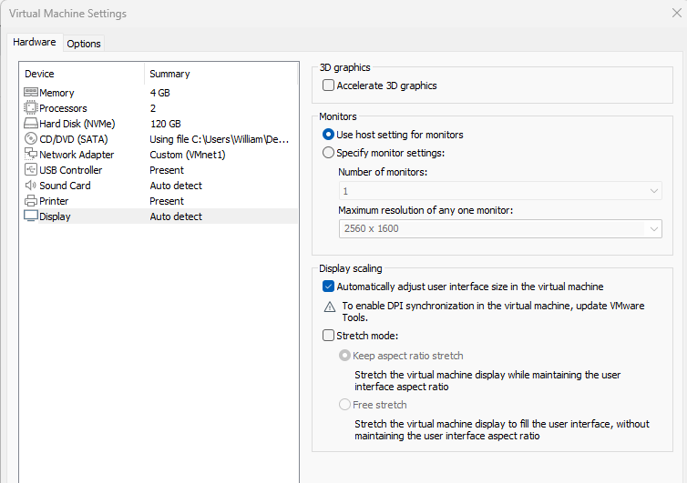
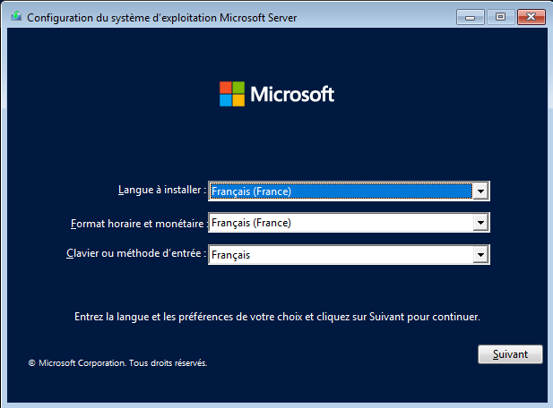
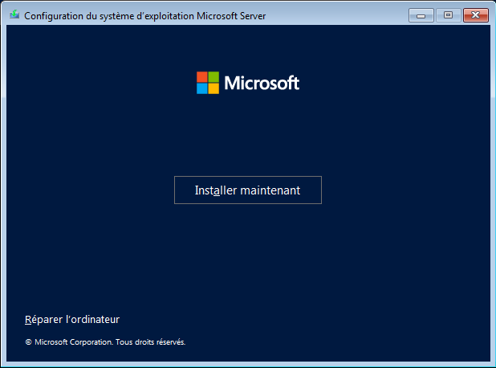
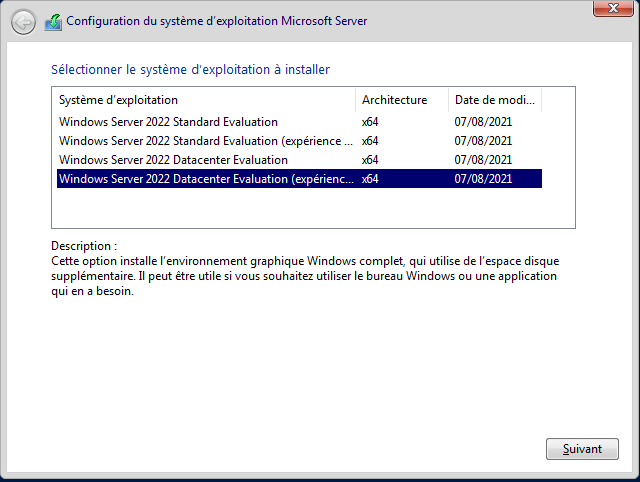
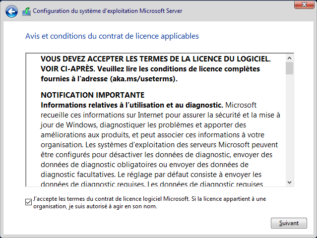
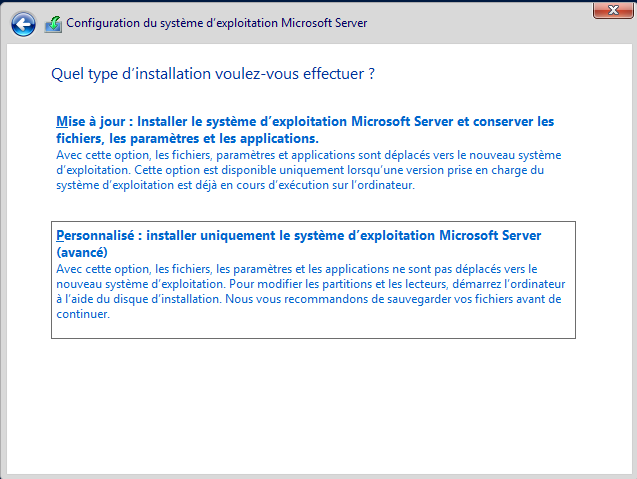
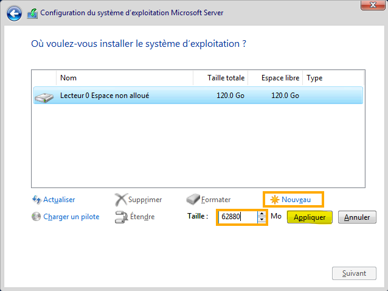

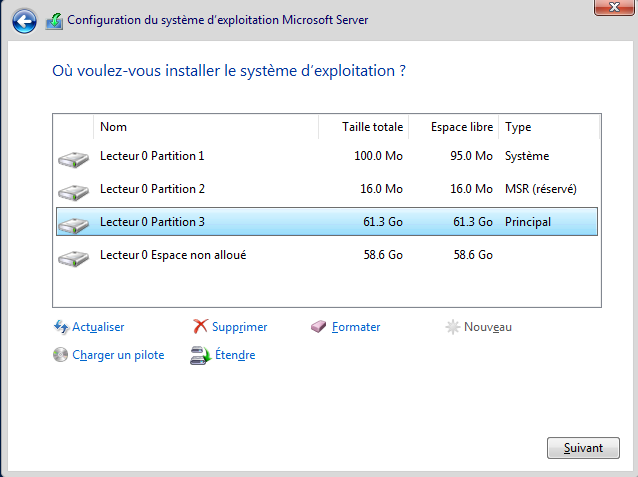

Saisir un mot de passe fort
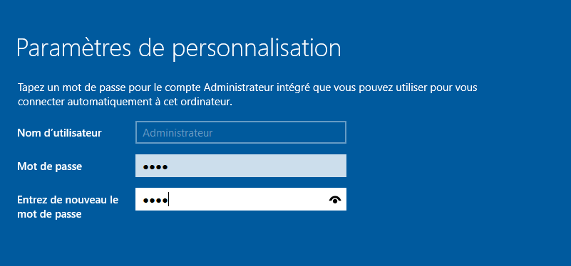

L'installation va démarrer.

Une fois l'installation terminée, se connecter en saisissant le mot de passe.


Après l'installation, on constate que trois dossiers sont créés par défaut :

- c:\windows\   NTDS.DIT  (dossier de la base de données)
- c:\windows\   NTDS.LOG (dossier des fichiers journaux)
- C:\           SYSVOL (script de démarrage et d'arrêt)


## Mise en place des icônes sur le bureau

- Clic droit sur le bureau
- Personnaliser 
- Thèmes
- Paramètres des icônes de bureau
- Cocher toutes les cases
- Valider

## Changement du nom de la machine ?

- Clic droit sur l'icône Ce Pc > Propriétés 
- Cliquer sur Renommer ce PC
- Cliquer sur Modifier
- Saisir le nouveau nom imposé par le cahier de charges. Exemple : DC2022
- Cliquer sur OK pour valider

Cette action nécessite un redémarrage de la machine. Mais il faut le faire ultérieurement car la configuration des **tools** exige aussi un redémarrage.

## Installation des tools :

Les tools permettent de :

- Installer les pilotes graphiques
- Copier-coller de la machine physique vers la machine vituelle et inversement
- Mapper ( créer un raccourci pour atteindre le dossier). Exemple : Créer un raccourci vers la machine physique

Pour installer les tools :

- Cliquer sur l'étiquette de la machine
- Cliquer sur Installer ou réinstaller VMWare Tools. 
- Le dossier VMWare Tools et monté sur le lecteur CD/DVD de la machine. L'exécuter en suivant l'assitance. 
- Un redémarrage est obligatoire.

## Activation du partage des dossiers

- Clic droit sur l'étiquette de la machine
- Cliquer sur Settings
- Aller dans l'onglet Options
- Aller dans Shared folders
- Sélectionner Always enabled
- Cocher la case ```Map as a network drive in Windows guests```
- Cliquer sur Add
- Cliquer sur Next
- Cliquer sur Browse pour sélectionner le lecteur (ex. C: de la machine physique)
- Cliquer sur Next
- Cliquer sur Finish
- Cliquer sur OK

Par défaut. Le lecteur Z est sélectionné et il apparait dans Ce PC.


## Mise en place de l'adresse ip en statique

### Procédure

- Ouvrir le cmd (Windows + r)
- Saisir ```cmd``` pour ouvrir l'invite de commandes
- Saisir ```ncpa.cpl``` pour accéder aux cartes réseaux
- Clic droit sur la carte réseau > Propriétés
- Sélectionner Protocole TCP/IP V4
- Cliquer sur le bouton Propriétés
- Cocher Utiliser l'adresse IP suivante
- Utiliser l'adresse IP : 172.16.10.250
- Masque de sous-réseau : 255.255.255.0
- Passerelle par défaut :  172.16.10.2
- Sélectionner : Utiliser l'adresse de serveur DNS suivante
    - Serveur DNS préféré : 172.16.10.250
    - serveur DNS auxialiare : 8.8.8.8
- Cliquer sur OK
- Cliquer sur Fermer

### Vérification

- Option 1 : 

    - Ouvrir le cmd (Windows + r)
    - Saisir ```cmd``` pour ouvrir l'invite de commandes
    - Saisir ```ipconfig``` dans l'invite de commande

- Option 2 : 

    - Clic droit sur l'icône réseau > Status > Détails


## Installation d'un rôle

- Accéder  au gestionnaire de serveur : 
    - Dans la barre de cortana, taper gestionnaire de serveur
    - OU Clic Droit sur ce PC > Gérer

- Aller dans l'onglet Gérer > Ajouter des rôles et fonctionnalités. Il ne reste plus qu'à suivre l'assistance :
    - Cliquer sur Suivant
    - Sélectionner Installation basée sur un rôle ou une fonctionnalité
    - Sélectionner un serveur du pool de serveurs puis Suivant
    - Cocher Services AD-DS (Active Directory - Domain Service) et cliquer sur Suivant
    - Cliquer sur Suivant
    - Cliquer sur Suivant
    - Cliquer sur Installer

## Promotion de la machine en contrôleur de domaine

- Cliquer sur le triangle jaune (en haut à droite)
- Promouvoir ce serveur en controleur de domaine
- Cliquer sur Ajouter une forêt
- Saisir epreuve.lan
- Suivre l'assistance :
    - Le nom netbios va apparaître
    - Il faut avoir le même niveau fonctionnel de la forêt. (ex. niveau fonctionnel de la forêt : Windows 2016 et niveau fonctionnel du domaine : Windows2016). Ceci permet de faire **l'approbation de deux serveurs de sites différents**
    - Saisir le mot de passe et confirmer le mot de passe

Quand on aura cliqué sur Terminer, l'installation va débuter.
Ensuite quand l'installation est terminée, l'ordinateur va redémarrer


Quand on voit service en rouge

on clique sur service
Type de démarrage
Décocher tout
cliquer sur redémarrer


## Configuration du DNS

### Création de la zone inversée


Aller dans Outils > DNS > Cliquer sur DC2022 (nom du serveur)

Cliquer sur fleche déscendante

Cliquer sur la premiere (Zones de recherche directe)

on voit Epreuve.lan


Dans la Zone inversée, il y a rien
On fait clic droit sur Zones de recherche inversée > Nouvelle zone
Faire Suivant partout
ID réseau : siaisir les trois premiers octets : 172.16.10

Suivant
Suivant
Terminer


### Mise à jour de l'enregistrement de pointeur (PTR)

Dans la colonne de gauche :
- cliquer sur la flèche à coté du nom de la machine
- cliquer sur la flèche à coté de zones de recherche directes
- cliquer sur la flèche à coté de epreuve.lan
- clic droit sur le nom de la machine
- cliquer sur Propriétés
- Cocher la case ```Mettre à jour l'enregistrement de pointeur (PTR) associé```
- Aller sur la zone inversée > Actualiser (touche F5)> On voit le pointeur
    